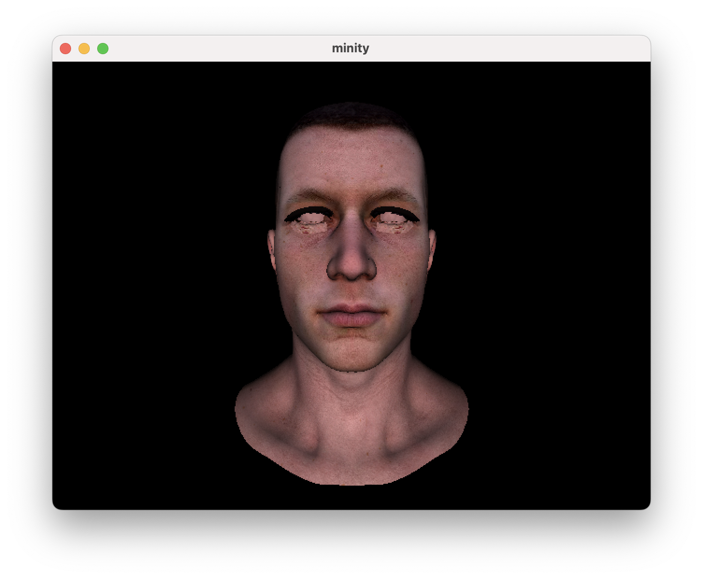
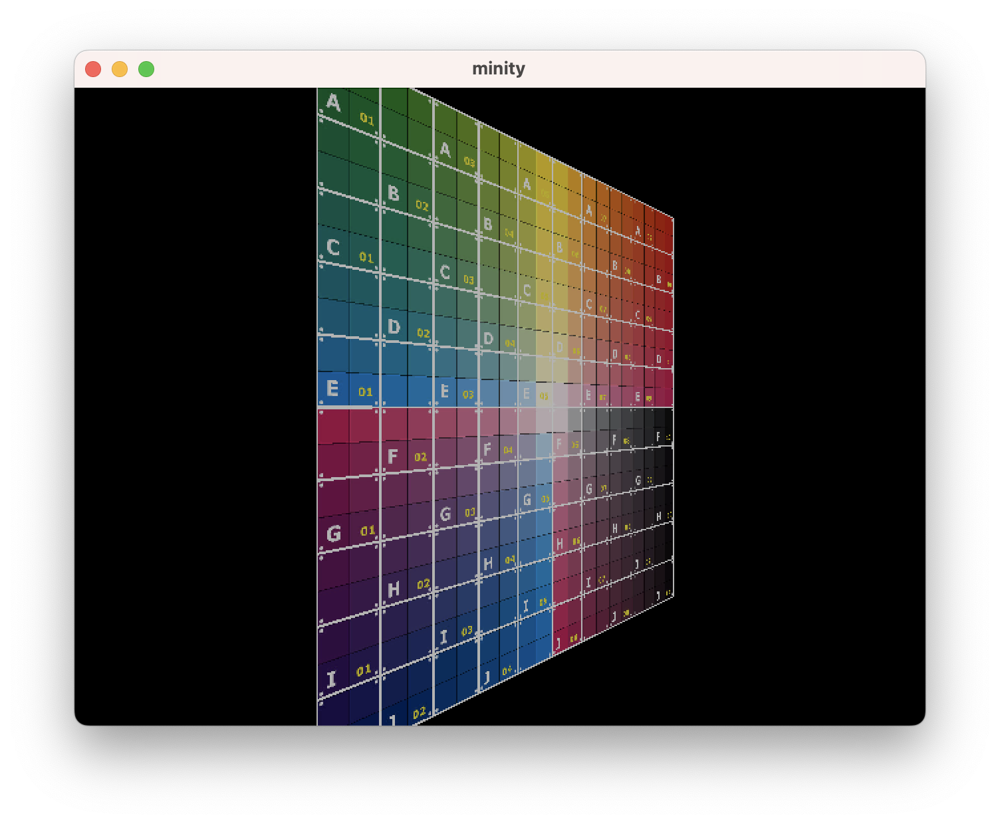
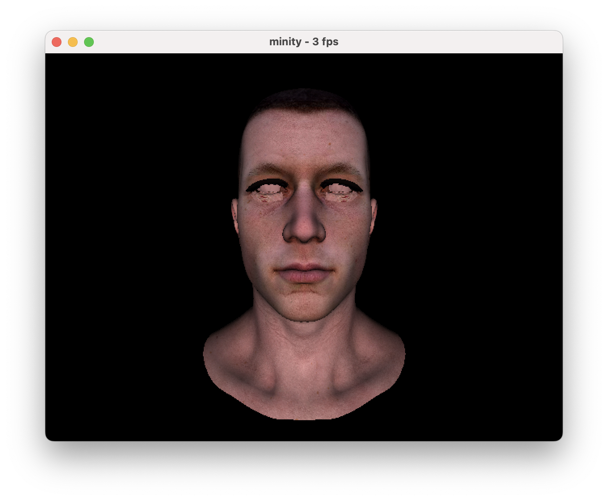
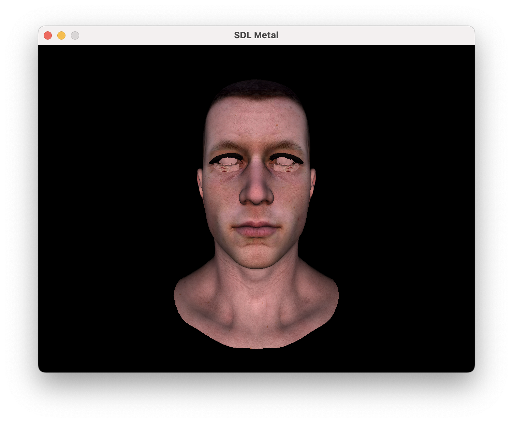

# minity
Minity is a minimal 3d game engine.

The main purpose is to do a fun project to re-learn [modern](https://docs.microsoft.com/en-us/cpp/cpp/welcome-back-to-cpp-modern-cpp?view=vs-2019) [C++](https://isocpp.org/) and try to follow the new [guidelines](http://isocpp.github.io/CppCoreGuidelines/CppCoreGuidelines). [SDL2](https://www.libsdl.org/) is used to get a simple canvas to draw to (`setPixel(x, y)`) and input handling. Math is written all by hand to re-learn vector and matrix operations. Write all graphics pipeline operations by hand to understand what the GPU does for us and compare them with [metal API](https://developer.apple.com/metal/)](https://developer.apple.com/metal/) results. [Dear ImGui](https://github.com/ocornut/imgui) is used for adding a statistics window to the rendered area.

Design choices for the software renderer:
 * matrices are in [row-major order](https://en.wikipedia.org/wiki/Row-_and_column-major_order) to align with maths notation (unlike OpenGL!)
 * coordinate system and rotation follow the [right-hand rule](https://en.wikipedia.org/wiki/Cartesian_coordinate_system) like OpenGL
   * axis rotation follows the right-hand rule: right thumb to positive axis and fingers point to positive rotation
 * camera is watching towards the negative Z-axis
 * screen coordinates are top-left (0,0) to bottom-right (screen-width, screen-height)
 * texture coordinates are top-left (0,0) to bottom-right (1,1) when flipped vertically on load
 * model faces are defined in clockwise winding order faces follow the LEFT-hand rule: e.g. center > up > right and LEFT-thumb points front

Working:
 * simple scene object with light, camera, and model (no entity hierarchy)
 * object loading from a simple obj file (vertices, faces, normals, and texture coordinates)
 * object scaling, rotation, and movement (translation)
 * rudimentary input handling for
   * moving the target ([arrow-keys](https://en.wikipedia.org/wiki/Arrow_keys), +, -)
   * rotate target with ([wasd](https://en.wikipedia.org/wiki/Arrow_keys#WASD_keys))
     * no z-rotation as q is currently for quit
 * [orthographic](https://en.wikipedia.org/wiki/Orthographic_projection) perspective correction with fixed [FoV, field-of-view](https://en.wikipedia.org/wiki/Angle_of_view)
 * rudimentary clipping (TODO: proper clipping)
 * back-face culling: face normal check to discard hidden triangles
 * draw wireframe, normals, point cloud, and axes
 * global face color
 * flat shading for models without pre-calculated normals (teapot)
 * [Phong-shading](https://en.wikipedia.org/wiki/Phong_shading) with normals for a smooth surface
 * textures with perspective-corrected model texture coordinates
 * basic math tests with [Catch2](https://github.com/catchorg/Catch2)
 * z-buffer check (instead of z-sorting the vertices before rendering)
 * rendering on [metal API](https://developer.apple.com/metal/)
 * simple util for generating a cube

TODO:
 * proper clipping (zoom in and the entire face is removed if clipped)
 * input handling:
   * z-rotation with q/e but move quit
   * map all keys
   * re-implement fps camera movement (now we move the target)
   * camera movement is not good for exploration
   * cannot change the target between mesh/camera/light
 * re-implement a simple util for generating a sphere
 * split scene header to smaller parts and have corresponding tests
 * wire-frame line color (done) > painting (done) > texturing (done) > anti-aliasing
 * vertex/face color from model
 * jump from classic make to CMake
 * consider `clang-format`
 * add address/thread/memory sanitizer

Main influences:
 * [OneLoneCoder/Javidx9](https://github.com/OneLoneCoder): console game engine and 3d videos
 * [Michael Kissner/Kayzaks](https://github.com/Kayzaks): StupidGL [gamasutra article](https://gamasutra.com/blogs/MichaelKissner/20160112/263097/Writing_a_Game_Engine_from_Scratch__Part_4_Graphics_Library.php)
 * [Gabriel Gambetta](https://gabrielgambetta.com/computer-graphics-from-scratch/): Computer Graphics from Scratch
 * [Dmitry Sokolov](https://github.com/ssloy/tinyrenderer): Tiny renderer

# Gallery

Tilted yellow sphere with 50 meridians and parallels in basic global illumination:

Simple statistics window (turn on with [F1]) to get basic fps and library information:

Head model with texture (incomplete mesh split and no eye/lash textures)

Texture with perspective-correct interpolation (no dent in face)

Rendering differences between software rasterizer and [metal API](https://developer.apple.com/metal/)

