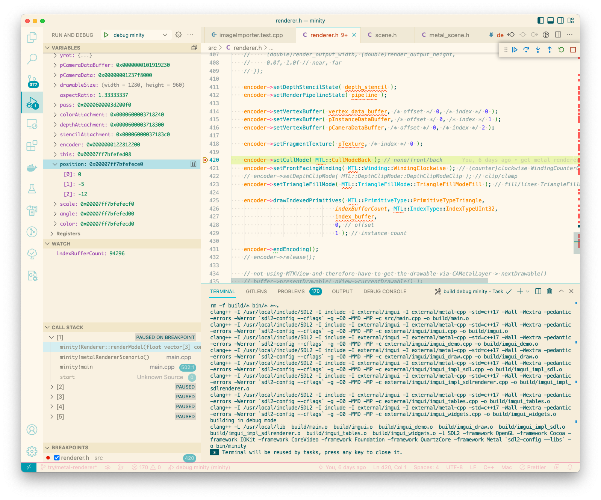
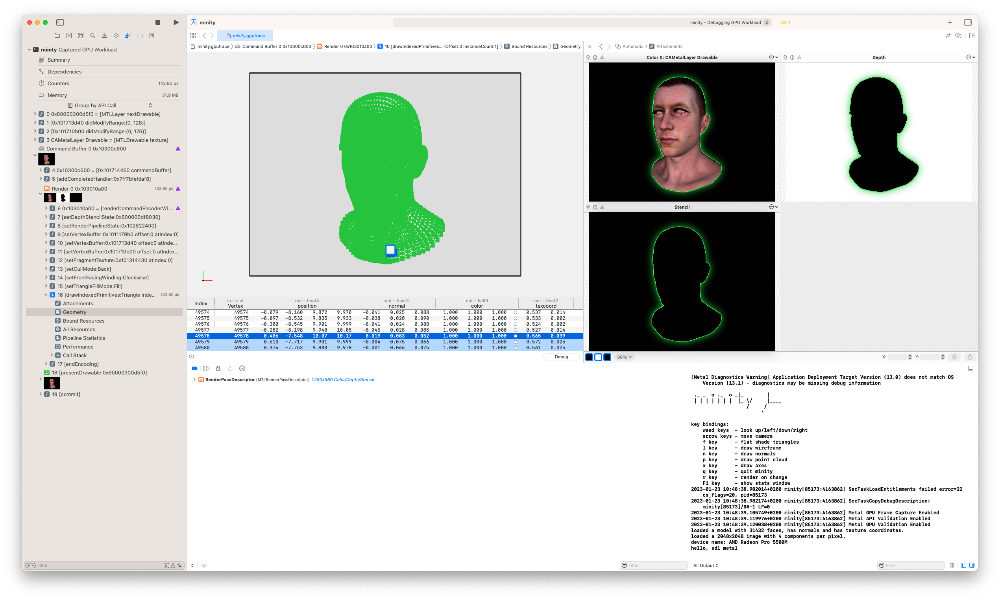
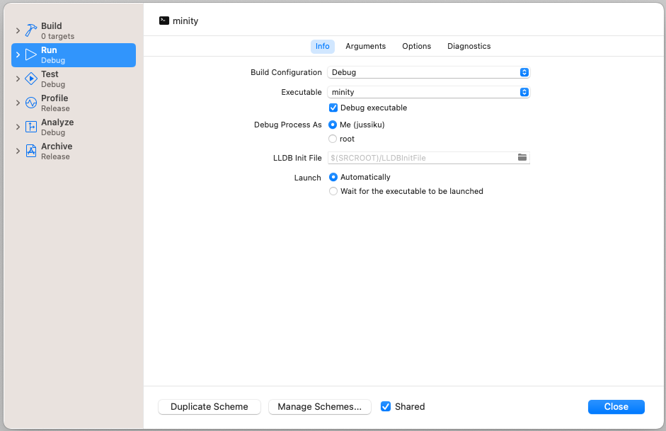
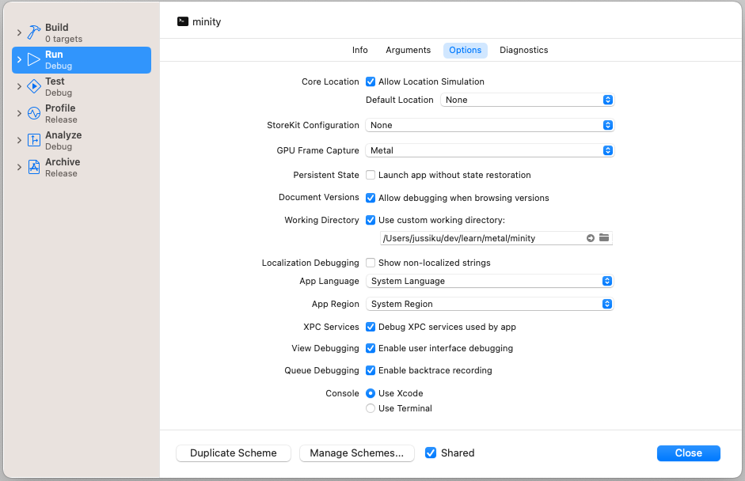
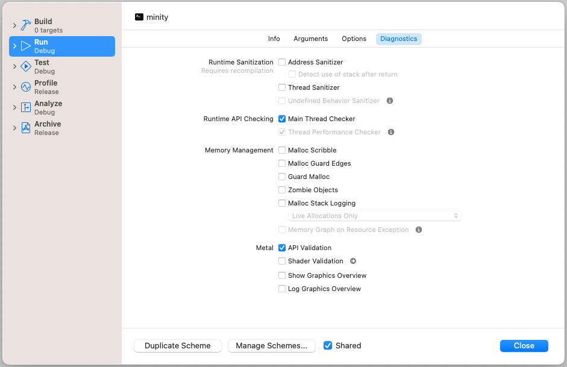

# Debugging with vscode and xcode

## Debug minity with VS Code

Add a launch configuration:

```
{
    "name": "debug minity",
    "type": "cppdbg",
    "request": "launch",
    "program": "${workspaceFolder}/bin/minity",
    "args": [],
    "stopAtEntry": false,
    "cwd": "${workspaceFolder}",
    "environment": [],
    "externalConsole": true,
    "MIMode": "lldb",
    "preLaunchTask": "build debug minity",
    "logging": {
        "engineLogging": false
    }
}
```

and then a debug task:

```
{
    "label": "build debug minity",
    "type": "shell",
    "command": "make clean minity",
    "problemMatcher": [],
    "group": "build"
},
```

1. Open Run and Debug view
2. Select `debug minity` configuration
3. Add a breakpoint somewhere
4. Click run (will need pw/fingerprint to gain control)
5. Lather, rinse, repeat...




## Debug metal API with Xcode

1. Build the debug target `make clean minity`
2. Open Xcode
3. Product / Scheme / New Scheme...
4. Add the configuration for (externally compiled) minity (see below)
5. Start the (debug) scheme (will need pw/fingerprint to gain control)
6. To debug metal, click the M-icon in the debug toolbar to capture GPU workload
   1. 
7. Find command buffer ... drawIndexedPrimitives
8. Double-click on Geometry in `minity.gputrace` window to inspect faces

See: https://developer.apple.com/documentation/metal/developing_and_debugging_metal_shaders



### Xcode debug scheme settings:





