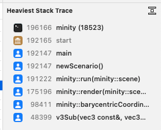

# LLVM/Clang Profiling

```
Makefile:
	CXXFLAGS += -g -O0 -fprofile-instr-generate -fcoverage-mapping
	LDFLAGS += -fprofile-instr-generate

make clean
make minity
export LLVM_PROFILE_FILE=./llvm.prof
./bin/minity

xcrun llvm-profdata merge -output=llvm.merge -instr llvm.prof
xcrun llvm-profdata show -all-functions -counts -ic-targets llvm.merge > llvm.log
xcrun llvm-cov show ./bin/minity -instr-profile=llvm.merge > profiling.log
less profiling.log
```

## Crash dumps
By default, crashes are reported into .crash files which can be found in
/Library/Logs/DiagnosticReports (system-wide)
and
~/Library/Logs/DiagnosticReports (user).

### use the console app to browse crash dumps

These files can be opened by using Console app, in User or System Reports.
The .crash files are in plain text format and should include relevant information about the crash.

https://stackoverflow.com/questions/9412156/how-to-generate-core-dumps-in-mac-os-x


## GUI profiling with Instruments

Instruments only needs the `-g` debug information to do the profiling.

```
make clean
make minity
instruments -l 30000 -t "Time Profile" -D instruments.memset.nodelay.trace ./bin/minity
open /Applications/Xcode.app/Contents/Applications/Instruments.app
```

Below are some simple cases to optimize (the unoptimized debug build) for a few more raw fps. The intention is not to complicate the code - just tackle the obvious mistakes that the compiler cannot optimize for us.

### Instruments Case 1
Just to learn the ropes, unoptimized (-O0) clearBuffer ate 30% of the CPU time.


Converting the for loops to memset dropped the impact 2ms/0%.


### Instruments Case 2
Again, to learn the unoptimized triangle filling took 880ms/7%.


Converting the simple flat shader to memset_pattern4 (for 32-bit color pattern filling) drove the triangle filling down to 80ms/0.7%.


### Instruments Case 3
After moving to Barycentric-based triangle rendering, the first profiling run showed that there are 2 main issues with the unoptimized implementation:
- Calculating Barycentric coordinates hogs almost half the CPU
- model construction takes a long(ish) time as well




Profiling log shows that the Barycentric coordinates were calculated 304M times, out of which 227M points were outside the triangle and only 77M were inside - what a waste! The obvious thing is to split and pre-calculate the non-changing parts before the (x, y) loop. It has a small ~8% impact:

Before: 

After: 


# References
 - https://newstudyclub.blogspot.com/2018/04/profiling-c-code-with-clang-using.html
 - https://apple.stackexchange.com/questions/197053/how-do-i-use-llvm-profdata-in-mac-os-x-yosemite?newreg=0305b56f785848478b41eb689c72bbe8
